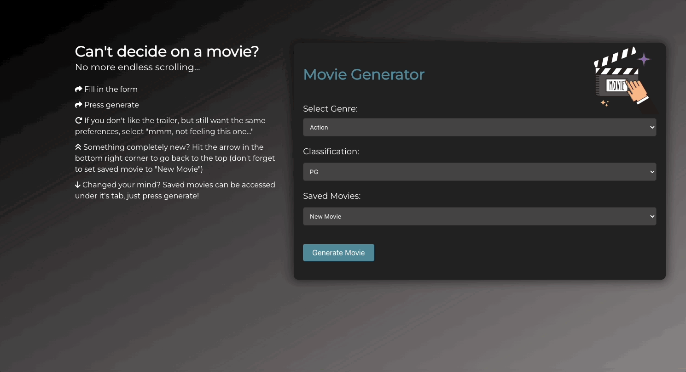

<h1 align="center">Movie Generator</h1>

Welcome to the Movie Recommender project! This web application helps you find movie recommendations based on your preferences. You can explore information about a movie, watch its trailer, and even save your favorite movies for future reference.

The following animation displays the applications functionality:



## Table of Contents
<!-- add in correct contents -->
- [How to Use](#usage-instructions)
- [Criteria](#criteria)
- [User Story](#user-story)
- [Objectives](#objectives)

- [Overview](#overview)
- [Technologies Used](#technologies-used)
- [API References](#api-references)
- [Run Locally](#run-locally)
- [Project Roadmap](#project-roadmap)
- [Links](#links)
- [License](#license)

## Authors
1. Adrian Ponze [@Y1va](https://www.github.com/Y1va)
2. Amir Tara [@Bjorn-Ironsidee](https://github.com/Bjorn-Ironsidee)
3. Jaya Baldwin [@jayabaldwin](https://github.com/jayabaldwin)
4. Reid Back [@NuclearReid](https://github.com/NuclearReid)

## Usage Instructions
<!-- step by step how to through website -->
- Fill in the genre and classification preferences in the form.
- Press the "Generate Movie" button to get a movie recommendation.
- Watch the trailer and decide if you want to save it for later.
- Use the saved movies list to revisit your favorite selections.

## Criteria
<!-- criteria this project had to meet -->
```
Conceive and execute a design that solves a real-world problem by integrating data received from multiple server-side API requests

Use a CSS framework other than Bootstrap.

Be deployed to GitHub Pages.

Be interactive (in other words, accept and respond to user input).

Use at least two server-side APIsLinks to an external site..

Use modals instead of alerts, confirms, or prompts.

Use client-side storage to store persistent data.

Be responsive.

Have a polished UI.

Have a clean repository that meets quality coding standards (file structure, naming conventions, best practices for class/id naming conventions, indentation, quality comments, and so on).

Have a quality README (including a unique name, description, technologies used, screenshot, and link to the deployed application).
```

## User Story
```
AS A user who is looking to watch a movie but doesn't know what to commit to.
I WANT A selection of movies that looks at my specifications and gives me a movie title/trailer with supporting info to help me select a movie to watch. 
SO THAT I save time trying to find something to watch and get right into a movie to enjoy the night.
  
AS A user who likes a movie that has been generated.
I WANT to be able to access a list of saved movies.
SO THAT I can continue to look for movies but still have the opportunity to change my mind.
```

<!-- 
## Objectives
```
Scenario: ...
GIVEN: ...
WHEN: ...
THEN: ...
``` -->

## Overview
#### Features:
- Genre Selection: Choose from various genres such as Action, Comedy, Drama, Fantasy, and Horror.
- Classification Filter: Specify the movie classification (e.g., G, PG, M, MA 15+, R 18+).
- Movie Generator: Fill in the form and press the "Generate Movie" button to get a random movie recommendation.
- Trailer Preview: Watch the trailer of the selected movie directly on the website.
- Save Favorites: Save your favorite movies to a list for easy access later.

<!-- why we wanted to develop it -->
#### Motivation for development:
Streamlining the process of selecting a movie

<!-- challenges -->
#### Challenges:
- Navigating GitHub in a team project
- Getting the YouTube data API to work
- Learning a new CSS library
- Ensuring the YouTube API returns the original movie and not a remake
- Responsivity issues with youtube video resizing and overlapping buttons

<!-- successes -->
#### Successes:
- Have the movies title/release date/synopsis and trailer displayed
- Be able to save the movie info into the user’s local storage, to be able to regenerate
- Create a responsive web application, that’s enjoyable for the user 


## Technologies Used
<!-- add a little write up to all of these -->
- VS Code: free source-code editor with built-in support for debugging, Git integration, and extensions for various programming languages
- HTML: standard markup language for creating and structuring web pages.
- JavaScript: versatile programming language used for creating dynamic content and interactivity on websites
- GitHub:web-based platform that provides hosting for version control using Git. It facilitates collaborative software development by offering features like code repositories, branching, pull requests, and issue trackingweb-based platform that provides hosting for version control using Git. It facilitates collaborative software development by offering features like code repositories, branching, pull requests, and issue tracking

#### External Libraries: 
- Bulma (CSS Library): modern CSS framework based on Flexbox, designed to facilitate the development of responsive and flexible web interfaces
- jQuery - Ajax: fast and lightweight JavaScript library that simplifies DOM manipulation and event handling
- Font Awesome: Provides icons for a visually appealing interface

#### Project Structure
index.html: Main HTML file containing the structure of the web page.
style.css: CSS file for styling the web page.
script.js: JavaScript file handling form submissions, API calls, and dynamic interactions.
listofmovies.js: Lists of movies categorized by genre.
modal.js: JavaScript file for modal functionality, currently not in use

#### Local Storage
The application uses local storage to store and retrieve the list of saved movies.

## API References
<!-- name, link to documentation and what the API does -->
[OMDB API](http://www.omdbapi.com/): retrieves movie information (synopsis, year of release) generated by the title of the film, based on user preferences
<br>
[YouTube API](https://developers.google.com/youtube/): fethces movie trailers for selected films

## Run Locally

Clone the project

```
  git clone https://github.com/NuclearReid/Movie-Picker.git
```

Go to the project directory

```
  cd movie-picker
```

Install dependencies

```
  npm install bulma
```

## Project Roadmap
<!-- future things we want to implement just in bullet points -->
- Include where to stream or buy the recommended movies
- Have the movie poster displayed if the youtube API isn’t working
- Streamline viewing saved movies using a modal, instead of having to regenerate
- Potentially implement other choices to plan your night in e.g. recipes, drinks, music, anime etc
- Integrate ability to search for shows as well as movies
- Add more genres and continue to update the range of movies

## Links
<!-- add link to "here" -->
Link to deployed application [here](https://nuclearreid.github.io/Movie-Picker/)

## License
[MIT](https://choosealicense.com/licenses/mit/)